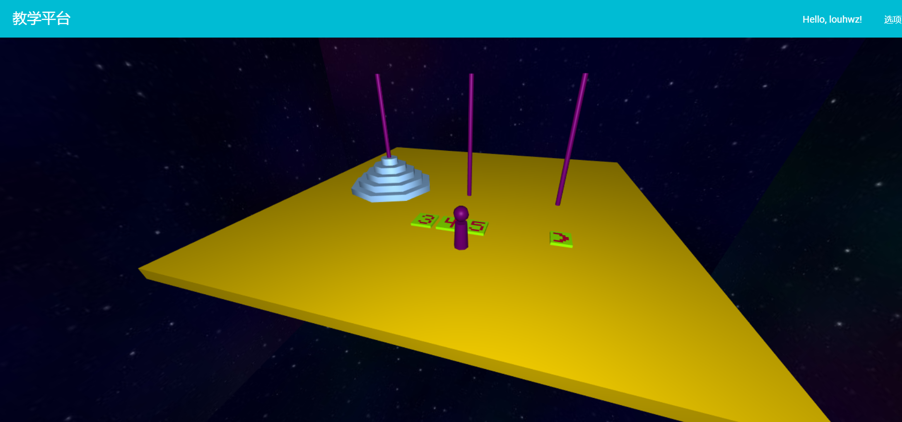
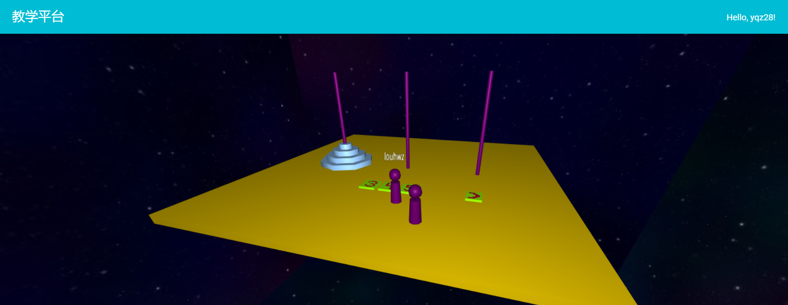
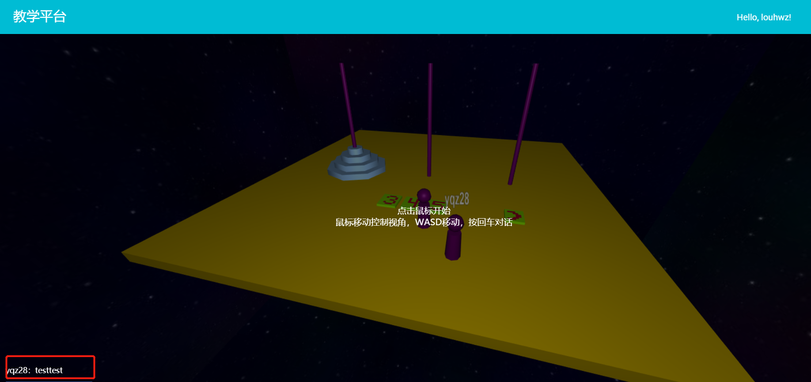

# 多人 Web3D教学式场景

## 1、开发任务概述

### 1.1 开发目标

在这个选题中，你需要实现一个完整的多人在线 Web3D教学式场景。该环境可以是一个博物馆、校园、室内等任意环境。用户拥有自己的虚拟形象，可以在这个环境中模拟真实世界中的操作，如行走、交流或其他自定义的交互动作等。以你选择的环境为主题， 添加相应的功能。

这个网站具有以下特点:

- 模拟真实世界中的环境；
- 多人可以选择进入同一个环境；
- 场景是教学式目的:如博物馆中，玩家可以漫游博物馆浏览文物学习知识；或者一个汉诺塔玩具，可以让学生模拟移动汉诺塔。

### 1.2 条件和约束

#### 1.2.1 前提约束

**不得抄袭，被发现后果自负。**

允许借鉴与学习开源项目与材料。

#### 1.2.2 依赖条件

能够熟练编写HTML、CSS、JavaScript，掌握JSON和RESTful的基础应用，对JavaEE基础架构、Spring Boot、Three.js、WebSocket、MyBatis、数据库设计有一定的认识。并对课程中涉及的其他Web技术有一定的基础和了解。

技术范围：

* Web基础课程的知识（HTML，CSS，JavaScript），AJAX技术。
* 前端采用Angular组件开发
* Web3D展示采用Three.js，客户端同步使用WebSocket
* 后端采用Spring Boot框架，MyBatis作数据库持久化层，数据库不限制，MySQL、MongoDB或者图数据库如Neo4j
* 采用前后端分离的架构，后端提供RESTful风格的API，给前端调用，前后端之间用JSON或者XML传递数据
* 前端与后端的程序均部署在云服务器上，在线上环境直接演示。

## 2. 系统基本功能与流程

### 2.1 功能要求

#### 2.1.1 基本功能

* 前台页面
  * 提供用户登录、注册；
  * 选择相相应的Web3D场景
* 用户后台页面
  * 记录用户信息、虚拟形象等
  * 根据你的场景，可选提供历史行为查看和分析功能。
* 虚拟Web3D场景
  * 有教学意义的Web3D场景，可以是一个丰富的大场景或者由几个案例组合起来。

- 支持多人加入同一个虚拟世界中:
    - 相互可见，并且行为共享;
    - 可以进行一定方式的交流;
    - 环境中可以有一些可交互性的实体，如可以打开的门。
- 维护虚拟世界的一致性:
    - 同一时刻各个化身能看到的场景应该是一致并且最新的。
    - 根据你的场景，可选提供实时聊天等附加功能。
- 系统部署在云服务器上，提供可以访问的公网地址。

#### 2.1.2 附加说明

- 3D 建模和动画不是课程重点，不要求建模非常逼真，可以采用下载的模型。

#### 2.1.3 进阶功能

* 用户可以选择自己的虚拟形象以在进入3D场景时与其他用户区分开来
* 加入一些人工智能因素，增加一个由计算机控制的智能虚拟人(NPC)，比如导游、服务员。可以根据用户化身的行为做简单的响应，比如介绍景点等。

### 2.2性能要求

除了功能需求外，平台还应在以下几个方面有一定的要求：

* 即时性：用户交互、信息位置同步及时准确。
* 灵活性：尽量使用灵活的设计，提高复用与适应性，后台项目架构要规范。
* 安全性：充分考虑到安全性，数据传输以及密码的保存，使用相关安全技术。

## 3. 系统说明

### 3.1 建议

* 采用前后端分离架构；
* 前端框架建议采用 Angular；
* 后端框架建议采用 SpringBoot；
* Web3D使用Three.js

### 3.2 参考资料

- assets文件夹中的**多人VR开发环境指北**，必看，[地址](https://github.com/2020-web/Project_Web3D)。
- 一个基于Spring Boot & MyBatis的[种子项目](https://github.com/lihengming/spring-boot-api-project-seed)，用于快速构建中小型API

### 3.3 参考截图

给出部分关键功能截图为同学们提供灵感。动手开发时不要求与demo完全相同。

##### 一个汉诺塔的教学场景

有第二个用户并且实时更新位置

用户可以在房间中聊天

## 4. 评分细则 

### 4.1 分数组成

- 基本功能分:即完成系统基本内容与流程，满分 100 分。 
- 进阶任务分:包括但不限于更精致的设计、场景，更好的开发部署流程、设计模式等。最多 15 分。 
- 个人工作分:根据小组分工及个人完成工作量得分。每组组员该项分数总和 30 分，根据贡献比例分摊。

个人最终得分 = 基本功能分 + 进阶任务分 + 个人工作分，值域为 [0, 145]。 

### 4.2 评分点

|功能项 | 得分项 | 说明 | 最高分数|
| ------ | ------ | ------ | ------ |
|UI和交互（10分） | 界面美观 |  | 5 |
| | 交互体验流畅 | 页面跳转和交互无明显失误，菜单和返回正常使用 | 5 |
| 基本流程（15分） |注册和登录页面| | 7 |
||用户后台页面 |视后台页面丰富程度给分，图表化展示数据可最多再+5分|8|
|3D 场景（45分） |正确显示一个可交互的 3D 场景 |一个合理的，自圆其说的3D场景|15|
| |场景的创意、功能的完成度和交互的丰富程度 |视3D环境的复杂和丰富程度给分|10|
| |支持多人加入同一个虚拟世界| 可以在场景中看到其他人的虚拟形象、ID等。 | 5 |
||正确更新其他用户的位置、行为变化| | 10|
|| 多用户间的文字交流                         |用户间更丰富的交互可最多再+10分|5|
|工程能力（20分）| 文档 |说明清晰完整，结构图准确易懂|10|
||代码风格、注释| 代码整洁、拓展好，设计模式等。 | 5 |
||系统架构| 复用性、可拓展性 | 5 |
|项目部署（10分） |将服务器部署到公有云上| | 5|
|| 使用Docker部署 ||5|
|进阶功能|简单响应用户虚拟行为的人工智能| | 5|
|                  |图表化展示后台记录的数据 ||5|
||其他合理亮眼的附加功能 |供学有余力的同学自由发挥，最多+5分|5|

### 4.3 评分点说明

1. 每一项的分数取决于该项功能的完成度。完成度和可用性越好，分数越高。 

2. 项目完整度和易用性评价标准:

- A. 功能残缺，不能完整运行，响应慢

- B. 完成规定的用户功能和操作，无明显瑕疵

- C. 界面舒适，操作合理，响应迅速，鲁棒性强

  A、B、C 分别对应 分数的0 - 30% ，30% - 70% 分，70% - 100% 分。

3. 附加功能必须在文档中明确写出，概述该功能并描述实现原理。 

4. 项目设计文档需要至少包含:
    - 项目组织以及其中每个文件的说明。
    - 关键功能实现的细节。
    - 服务器部署配置的详细介绍。

5. 团队分工文档需要至少包含: 
    - 团队成员、分工、具体完成工作，列出每个人的贡献比例。
    - 其他你们想说明的问题。 
    
## 5. 提交

1. 提交物包含以下三项:
    - **源代码**：推荐使用 Git 进行协作，提交到 GitHub 等 Git 托管平台上。 
    - **文档**：推荐使用 Markdown 编写项目文档，与源代码一同提交到 Git 托管平台上。 
    - **可供访问的公网地址**，以及系统的操作说明(玩法)。

2. 提交物需要压缩打包提交到 **超星学习通** 上，文件名中请包含小队所有成员的姓名与学号。 

3. 友情提示：请尽早开工，本学期只有一个 Project，临时赶工很有可能完不成。
